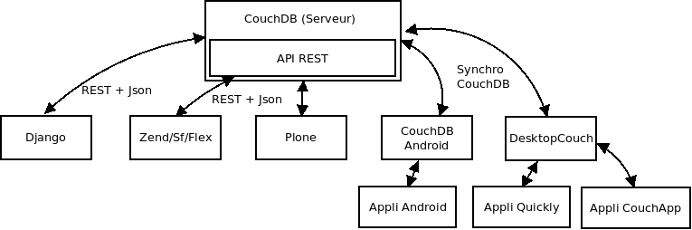

Welcome to the DropIt's documentation!
======================================

Drop it! is a set of applications to manage your notes, **easily**. 
Drop It! comes with a full set of fonctionalities like versionning and 
synchronisation.

It's possible to write your notes on your desktop, on your mobile phone
or on a webapp, and you can retreive them via any of this ways.

Here is the global architecture of the application :

Contents:

.. toctree::
   :maxdepth: 2
   
   install   
   dropit-api
   note
   conflicts
   todo

